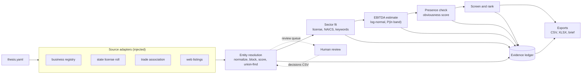

# thesis_to_target

Turn an investment thesis into a ranked list of private-company targets, where every number traces back to the records it came from.

[](https://github.com/maxskrehbiel/thesis_to_target/actions/workflows/ci.yml)  

## Overview

Buy-side sourcing usually starts from the same few commercial databases, so the companies found there are the ones every other buyer is already calling. The advantage lies in a more complete universe, including firms that only show up in license rolls, registries or directories, and in knowing which of them the databases miss, with evidence a reviewer can check. `thesis_to_target` reads a thesis written in YAML (industry keywords and NAICS codes, an EBITDA band, a geography), pulls records from several overlapping and messy sources, resolves them into companies, classifies sector fit, estimates EBITDA as a probability distribution, scores how visible each company already is, and ranks the ones in scope. Every claim it makes is written to an evidence ledger as Claim, Value, Evidence, Source and Confidence, and the exports point back into that ledger. All company data in this repository is synthetic: it is generated from a seed by the only source adapter shipped here, and no real business is described.

## Architecture



| Stage | What it does |
| --- | --- |
| Sources | Each adapter maps one feed onto a common record shape. The pipeline receives adapters and presence checkers from the caller and never imports the synthetic generator. |
| Entity resolution | Records are normalized, compared only within cheap blocks, scored and clustered into companies; borderline pairs go to a review queue. |
| Sector fit | License, NAICS and keyword evidence set a fit tier (A to D), a segment and a service mix. |
| EBITDA estimate | Size signals become an employee range, then a log-normal EBITDA distribution and the probability that EBITDA falls in the thesis band. |
| Presence check | Each company is looked up in the large databases; the result is an obviousness score. |
| Screen and rank | Geography, fit and ownership screens set scope; a weighted composite ranks the rest. |
| Exports | A ranked CSV and workbook, the full ledger, the review queue, the raw records and a short markdown brief. |

## Quickstart

```bash
git clone https://github.com/maxskrehbiel/thesis_to_target.git
cd thesis_to_target
python -m venv .venv
source .venv/bin/activate          # Windows: .venv\Scripts\activate
pip install -e ".[dev]"
thesis_to_target demo
```

The demo runs the thesis bundled with the package against the synthetic world (seed 42), writes `./demo_output/`, then grades its own output against the generator's ground truth and exits 1 if any check fails. It is offline, works from any directory and takes a few seconds. The committed copy of its output is in `examples/`; start with `examples/target_brief.md`.

## Usage

### Command line

| Command | Purpose |
| --- | --- |
| `thesis_to_target demo [--out DIR]` | Run the bundled demo thesis, write outputs (default `demo_output/`) plus a copy of the thesis, and self-check against the synthetic truth. |
| `thesis_to_target run --thesis PATH --out DIR [--seed N] [--n-firms N] [--adjudications CSV]` | Run any thesis. `--seed` (0 or more) and `--n-firms` (1 or more, up to the generator's capacity) change the synthetic world. |
| `thesis_to_target validate --thesis PATH` | Check a thesis file without running it. |

`python -m thesis_to_target ...` works the same way. Logging goes to stderr at WARNING by default; add `-v` for progress (INFO) or `-vv` for detail (DEBUG) before the subcommand.

| Exit code | Meaning |
| ---: | --- |
| 0 | Success. |
| 1 | A domain check failed: the evidence ledger failed verification, or the demo's self-check did not pass. |
| 2 | Usage, configuration or input error, reported as one line on stderr (bad arguments, invalid thesis, missing file, generator capacity exceeded). |
| 3 | A required optional dependency is missing. This package has no optional dependencies, so it never returns 3. |

Each run writes:

| File | Contents |
| --- | --- |
| `targets.csv` | In-scope companies in rank order, with tier, fit, EBITDA median and 95% range, P(EBITDA in band), obviousness and the span of ledger claims behind the row. The `data` column says `synthetic` or `source`. |
| `targets.xlsx` | The same, plus the full universe, ledger, review queue, raw records, assumptions and QA as sheets. |
| `evidence_ledger.csv` | Every claim about every company. |
| `review_queue.csv` | Record pairs that scored in the review band, with an empty `decision` column. |
| `raw_records.csv` | Every source record as received. |
| `target_brief.md` | Funnel, top targets and the evidence behind the top three. |

To close the review loop, fill the `decision` column of `review_queue.csv` with `merge` or `reject` and pass the file back with `--adjudications`. Human decisions override the automatic ones.

### Python API

```python
from thesis_to_target.export import export_run
from thesis_to_target.pipeline import run_pipeline
from thesis_to_target.registry import build_adapters, build_presence_checkers
from thesis_to_target.thesis import load_demo_thesis

thesis = load_demo_thesis().with_synthetic(seed=7)
result = run_pipeline(thesis, build_adapters(thesis), build_presence_checkers(thesis))

for company in result.ranked()[:5]:
    p = company.estimate.p_in_band if company.estimate else 0.0
    print(company.rank, company.name, company.state, f"P(in band)={p:.2f}")

top = result.ranked()[0]
print(result.ledger.last(top.company_id, "ebitda_estimate"))
export_run(result, "demo_output/api")
```

This runs offline against the synthetic world. For a real deployment, pass your own adapters and presence checkers to `run_pipeline` instead of the ones `registry.py` builds.

### Adding a source

An adapter subclasses `SourceAdapter`, returns `RawRecord` rows and does no cleaning or matching. Facts go into `attributes` under a standard vocabulary (`naics`, `license_type`, `employee_band`, `stated_headcount`, `locations`, `services`, `parent_entity` and a few more, listed in `sources.py`). Adapters that can say which records truly belong together may also implement `ground_truth()`; runs over such sources are graded automatically.

```python
import csv
from pathlib import Path

from thesis_to_target.models import RawRecord
from thesis_to_target.registry import register_adapter
from thesis_to_target.sources import SourceAdapter


class LicenseFileAdapter(SourceAdapter):
    """Reads a license roll that is already on disk as CSV."""

    def fetch(self, thesis):
        with Path(self.options["path"]).open(encoding="utf-8") as fh:
            return [
                RawRecord(
                    record_id=f"LIC-{i:05d}",
                    source=self.feed,
                    name=row["licensee"],
                    city=row["city"],
                    state=row["state"],
                    attributes={"license_type": row["class"], "license_status": row["status"]},
                )
                for i, row in enumerate(csv.DictReader(fh), start=1)
            ]


register_adapter("license_file", LicenseFileAdapter)
```

```yaml
sources:
  - {adapter: license_file, feed: state_license, trust: 0.85, path: data/licenses.csv}
```

Presence checks plug in the same way through `register_presence`; `ListingIndexChecker` already implements same-state fuzzy matching against any list of listings.

### Optional model classification hook

Keyword rules decide fit by default. A thesis can name a function to consult for companies the rules leave at tier C or D:

```yaml
classify:
  llm_hook: {enabled: true, callable: "my_package.hooks:classify"}
```

The function receives `{"company_id", "name", "text"}` and returns `{"in_sector": {"value": bool, "evidence": "<exact quote>"}}`. It is off by default, needs no key, and this repository contains no model client. The verdict is always recorded in the ledger, but it can only raise a company to tier B when the quote appears word for word in the company's own text; an unverifiable quote is recorded as `weak` and ignored. Errors raised inside the hook propagate with their traceback.

## How it works

### Entity resolution

The same business appears under several names: a registry prints `BRAXMOOR FIRE PROTECTION, INC.`, a license roll prints `Braxmoor Fire Prot.`, a directory lists `Braxmoor Fire Protecton` (with a typo), and a holding company files as `Ostrvane Holdings, LLC d/b/a Braxmoor Fire Protection`. A DBA ("doing business as") is the operating name a company trades under.

Normalization lower-cases names, strips accents, punctuation and legal suffixes (Inc, LLC, Corp), merges initials (`A.B.C.` becomes `abc`) and splits DBAs so a record can match on either name. Abbreviations are expanded from two lists: industry-neutral ones in the library (`Svcs` becomes `service`) and the thesis's own vocabulary (`Prot.` becomes `protection` in the demo). Phones become ten digits and websites become a bare host.

Comparing every record with every other grows with the square of the record count, so two records are compared only if they share a blocking key (Christen, 2012): the same phone, website, ZIP code or normalized name, or the same state plus the first distinctive word of the name (or its first three letters). Each candidate pair then gets a score from 0 to 100:

```
name  = mean(token_sort_ratio, token_set_ratio)          best pair of name variants
name  = min(name, distinctive_similarity + 15)           industry words alone cannot match
score = name + 8 (same phone) + 8 (same website) + 3 (same ZIP) - 15 (different states)
```

`token_sort_ratio` compares the names with their words sorted, so word order does not matter; `token_set_ratio` tolerates extra words. The cap uses only the distinctive words, meaning words the thesis does not list as generic industry vocabulary, so `Braxmoor Fire Protection` and `Quenholt Fire Protection` do not look alike just because they share an industry. A score of 92 or more merges the pair, 80 to 92 sends it to the review queue, and anything lower is no link.

Merged pairs are joined with union-find (Tarjan, 1975), a structure that groups records into connected sets: if A matches B and B matches C, all three are one company. Because that chaining can join two records that look nothing alike, any cluster whose weakest internal pair scores under 70 is flagged for review. The display name, phone, website and state are then chosen by a vote weighted by each source's trust (registry 0.90, license roll 0.85, association 0.70, web listing 0.60 in the demo), and the legal name comes from the most trusted record that prints a legal suffix.

### Sector fit

| Tier | Evidence |
| --- | --- |
| A, verified | A sector license, or an in-thesis NAICS code together with sector keywords in the company's own service text |
| B, likely | Sector keywords in service text, or an in-thesis NAICS code plus a sector word in the name |
| C, name only | Only the name, or only the NAICS code, points to the sector |
| D, no evidence | Nothing points to the sector, or the service text describes an adjacent trade |

NAICS (North American Industry Classification System) codes are coarse: a fire-sprinkler contractor and an HVAC shop share code 238220, so NAICS supports a tier but never decides it. The segment is the thesis segment with the most keyword hits, and the service mix compares recurring words (inspection, testing, monitoring) with project words (installation, new construction), calling a side dominant when it has at least twice as many.

### EBITDA estimate and P(EBITDA in band)

EBITDA is earnings before interest, taxes, depreciation and amortization. Private companies rarely publish it, so it is estimated from size signals and carried as a distribution rather than a single number.

Each size signal first becomes a range of employees:

| Signal | Range | Weight |
| --- | --- | --- |
| Reported employee band, e.g. `20-49` | the band | 1.0 |
| Headcount the company states, n | 0.85n to 1.25n | 0.9 |
| Number of locations, b (2 or more) | 6b to 25b | 0.5 |
| Licensed technicians, k (2 or more) | at least 1.25k (a floor) | 0.6 |

Ranges are combined by a weighted geometric mean of their ends. If two ranges contradict each other, the combined range widens to cover both and the estimate is graded low confidence. Floors can only raise the low end.

The median multiplies the geometric midpoint, `sqrt(low x high)`, of each input range:

```math
\text{EBITDA}_{\text{median}} = \text{employees}_{\text{mid}} \times \text{revenue per employee}_{\text{mid}}(\text{segment}) \times \text{margin}_{\text{mid}}(\text{service mix})
```

Business size multiplies and errors are proportional, so ln(EBITDA) is modeled as normally distributed (EBITDA is log-normal). Each input range is read as a central 95% interval, which gives a log-space standard deviation per factor:

```math
\sigma_i = \frac{\ln(\text{high}_i) - \ln(\text{low}_i)}{2 \times 1.96}
```

The default `endpoints` mode adds the three (`sigma = sigma_employees + sigma_revenue + sigma_margin`), which makes the 95% EBITDA range run exactly from low x low x low to high x high x high; the code computes those two bounds as exact products rather than through `exp` and `log`. The optional `independent` mode adds the three in quadrature (`sigma = sqrt(sum of squares)`), which is narrower and assumes the three ranges are unbiased and unrelated; on the synthetic world that narrower interval missed the true value too often, so it is not the default. Sigma never drops below 0.15. With mu = ln(median EBITDA) and Phi the standard normal cumulative distribution function:

```math
P(\text{EBITDA} \ge T) = 1 - \Phi\left(\frac{\ln T - \mu}{\sigma}\right) \qquad P(\text{in band}) = P(\text{EBITDA} \ge \text{min}) - P(\text{EBITDA} \ge \text{max})
```

As a worked example, take a firm that reports 20 to 49 employees, in a segment running $150k to $210k revenue per employee with a 10% to 16% margin. The median is sqrt(20 x 49) x sqrt(150k x 210k) x sqrt(0.10 x 0.16), about 31.3 x $177k x 12.6%, or roughly $703k. The 95% range is $300k (20 x $150k x 10%) to $1.65M (49 x $210k x 16%), so sigma is about 0.43 and P(EBITDA >= $1M) is about 0.21. A thesis with a $1M floor keeps this firm on the watchlist rather than discarding it.

### Obviousness

Each resolved company is looked up in every configured database by same-state fuzzy name match (a score of 90 or more). Its obviousness is the weighted share of places it already shows up:

```
obviousness = (0.35 * in_db_a + 0.30 * in_db_b + 0.25 * in_investor_db + 0.10 * has_website) / 1.00
```

A company below 0.30 is flagged non-obvious; with the demo weights, a listing in either commercial database is enough to make a company obvious. Absence is recorded with `inferred` confidence rather than `confirmed`, because a name that fails to match may still be listed under a different spelling.

### Evidence ledger

Every stage writes claims, and nothing is exported without one. A claim is one of three kinds:

| Kind | Meaning | Must cite |
| --- | --- | --- |
| `observed` | A source record states it | Record ids, all belonging to the same company |
| `external` | A lookup outside the records | The database and a listing id or query |
| `derived` | Computed from other claims | Earlier claim ids about the same company |

Confidence runs `confirmed`, `strong`, `inferred`, `weak`, plus `contradictory` for sources that disagree. A derived claim may not be more confident than the strongest claim it rests on, so an estimate built on a weak signal cannot be presented as strong. These rules are enforced when a claim is written. After the run, `verify` checks what the ledger cannot know on its own: every claim is about an existing company, every cited record exists and belongs to that company, and every exported row has the claims behind its columns. A violation stops the run with exit code 1. Claim ids are deterministic (`C0018.15` is the fifteenth claim about company `C0018`).

Three rows from the demo ledger (synthetic):

| claim_id | claim | value | evidence | confidence |
| --- | --- | --- | --- | --- |
| C0018.06 | license | Fire Sprinkler Contractor (Active) | LIC-0009: 'Fire Sprinkler Contractor', status Active | confirmed |
| C0018.15 | ebitda_estimate | 3009683 | 105 employees x $177k revenue/employee (sprinkler) x 16.1% margin (recurring_heavy) = $3.01M median; 95% range $1.47M-$6.15M (sigma 0.36, endpoints) | inferred |
| C0018.21 | obviousness | 0 | (0.35xcommercial_db_a(0) + 0.30xcommercial_db_b(0) + 0.25xinvestor_db(0) + 0.10x website(0)) / total weight = 0.00; non-obvious (cut-off 0.30) | inferred |

### Screening and ranking

Companies outside the thesis states, at fit tier D, serving homeowners only, or with a listed parent owner are excluded, and the reason is recorded. The rest are ranked by

```
composite = 100 * (0.45 * P(in band) + 0.25 * fit + 0.20 * (1 - obviousness) + 0.10 * evidence)
evidence  = 0.5 * min(1, sources / 3) + 0.5 * size_confidence_credit
```

where fit is 1.0, 0.75, 0.4 or 0 for tiers A to D, and size confidence earns 1.0, 0.65 or 0.35 for high, medium or low. The top 12 with P(in band) of at least 0.40 are tiered Priority, and the rest of the in-scope list is the Watchlist. All weights and cut-offs live in the thesis file.

### Reproducibility

The same seed produces the same bytes on every platform. The generator draws every random number from `numpy.random.Generator.random()`, whose stream is fixed by the PCG64 algorithm (O'Neill, 2014), and builds normal draws from it with the Box-Muller transform (Box and Muller, 1958), rather than from higher-level NumPy methods whose streams may change between releases. Money is rounded half-up from the exact float value, and the 95% EBITDA bounds are exact products, so no printed number depends on platform-specific `exp` or `log` results. CI regenerates `examples/` and fails if any text file differs from the committed copy.

## Project layout

```
thesis_to_target/
├── .github/workflows/ci.yml
├── examples/                      committed demo output (synthetic), regenerated by `demo --out examples`
│   ├── thesis.yaml
│   ├── targets.csv
│   ├── targets.xlsx
│   ├── evidence_ledger.csv
│   ├── review_queue.csv
│   ├── raw_records.csv
│   └── target_brief.md
├── src/thesis_to_target/
│   ├── cli.py                     run | demo | validate, exit codes
│   ├── registry.py                composition root: adapter and checker lookup
│   ├── thesis.py                  YAML loading and validation
│   ├── config.py                  frozen stage configuration
│   ├── errors.py                  exception hierarchy
│   ├── models.py                  records, companies, stage results
│   ├── sources.py                 source-adapter interface
│   ├── normalize.py               name, phone and website normalization
│   ├── resolve.py                 blocking, scoring, union-find, canonical records
│   ├── identity.py                identity claims for each company
│   ├── classify.py                fit tier, segment, service mix, model hook
│   ├── estimate.py                employee range, log-normal EBITDA, band probability
│   ├── presence.py                database presence and obviousness
│   ├── evidence.py                evidence ledger and its rules
│   ├── rank.py                    screens, composite score, tiers
│   ├── pipeline.py                stage orchestration over injected sources
│   ├── qa.py                      grading against ground truth, demo pass marks
│   ├── formatting.py              money rounding and formatting
│   ├── export.py                  CSV and Excel writers
│   ├── brief.py                   markdown brief
│   ├── resources/
│   │   └── demo_thesis.yaml       the demo thesis, shipped as package data
│   └── synthetic/
│       ├── vocabulary.py          fictional syllables, places, trades
│       ├── draws.py               seeded draws on the raw random stream
│       ├── mess.py                abbreviations, typos, formats
│       ├── firms.py               firm generation and capacity limits
│       ├── feeds.py               messy feeds and database listings
│       ├── world.py               world assembly
│       └── adapter.py             synthetic source adapter and presence checker
├── tests/
├── pyproject.toml
├── LICENSE
└── README.md
```

## Development

```bash
pip install -e ".[dev]"
ruff check .
ruff format --check .
mypy src
pytest --cov=thesis_to_target --cov-report=term-missing
thesis_to_target demo --out examples
git diff --exit-code -- examples/ ':(exclude)*.png' ':(exclude)*.xlsx' ':(exclude)*.kmz'
```

The tests cover entity-resolution cases (suffixes, abbreviations, typos, DBAs, look-alike firms, shared phone lines, adjudication, chaining), exact endpoint arithmetic and half-up rounding, the log-normal math against closed-form values, the generator's capacity limit and pinned random stream, exit codes 0, 1 and 2, and end-to-end runs graded against the synthetic ground truth. Each ledger rule, both those enforced when a claim is written and those checked by `verify`, has its own test in `tests/test_evidence.py`. Tests that need a network would carry the `integration` marker, which is deselected by default (`pytest -m integration` runs them); there are none today. CI runs the commands above on Python 3.11 and 3.12.

## Data

Everything in this repository is synthetic. The generator in `src/thesis_to_target/synthetic/` builds fictional firms from a seed, with names made of nonsense syllables (`Braxmoor`, `Quenholt`), fictional towns, phone numbers on the 555-0100 to 555-0199 lines reserved for fiction, and websites on the `.example` domain reserved by RFC 2606 (Eastlake and Panitz, 1999). It renders registry, license, association and web-listing records from those firms with deliberate damage (ALL-CAPS names, holding-company DBAs, abbreviations, typos, dropped words, duplicate listings, second phone lines) and plants look-alikes: the same name in two states, the same name root in one town, and two firms sharing a phone line. Database presence is simulated to rise with firm size. Any resemblance to a real business is coincidental.

Because the generator knows which records belong to which firm, and each firm's true EBITDA and database listings, every synthetic run is graded (`qa` sheet and brief): entity-resolution precision and recall, how often the true EBITDA lands inside the stated 95% range, how closely mean P(in band) matches the observed share, the Brier score of P(in band) (Brier, 1950), and presence-check accuracy. The demo fails if precision drops below 0.95, recall below 0.90, range coverage below 0.80, presence agreement below 0.90, or the calibration gap rises above 0.15. These describe synthetic data only.

NAICS codes are published by the U.S. Census Bureau. The revenue-per-employee and margin ranges in the demo thesis are illustrative assumptions, not benchmarks. Dependencies: NumPy (BSD-3-Clause), openpyxl (MIT), PyYAML (MIT), RapidFuzz (MIT).

## Limitations

- The only data here is synthetic, and the generator shares the model's structure. The QA numbers show that the mechanics work as designed; they say nothing about accuracy on real sources.
- Entity resolution is rule-based with hand-set thresholds. Same-named records in different states are queued for review unless they share a phone or website, and a typo in the first letters of a name is only caught through a shared phone, website or ZIP code.
- Presence checks match names only. A company listed under a very different name is scored as absent, which overstates non-obviousness; that is why absence is recorded as `inferred`.
- Sector fit reads short service and category phrases with keyword rules. This repository does not fetch or read company websites.
- The EBITDA model assumes log-normal errors and reads every input range as a 95% interval. Revenue per employee and margins come from the thesis, so an optimistic thesis produces optimistic estimates.
- Composite weights and tier cut-offs are judgment calls, exposed in the thesis file rather than learned.
- The synthetic generator's name and fictional phone pools are fixed, which caps a world at a few hundred base firms; larger requests are refused up front.
- Everything runs in memory in one process, which suits tens of thousands of records, not tens of millions.

## References

- Box, G. E. P., and Muller, M. E. (1958). A note on the generation of random normal deviates. *The Annals of Mathematical Statistics*, 29(2), 610-611.
- Brier, G. W. (1950). Verification of forecasts expressed in terms of probability. *Monthly Weather Review*, 78(1), 1-3.
- Christen, P. (2012). *Data Matching: Concepts and Techniques for Record Linkage, Entity Resolution, and Duplicate Detection*. Springer.
- Eastlake, D., and Panitz, A. (1999). *Reserved Top Level DNS Names*. RFC 2606, Internet Engineering Task Force.
- O'Neill, M. E. (2014). *PCG: A Family of Simple Fast Space-Efficient Statistically Good Algorithms for Random Number Generation*. Technical Report HMC-CS-2014-0905, Harvey Mudd College.
- Tarjan, R. E. (1975). Efficiency of a good but not linear set union algorithm. *Journal of the ACM*, 22(2), 215-225.
- U.S. Census Bureau. North American Industry Classification System (NAICS).

## License

MIT © Maxwell Krehbiel. See [LICENSE](LICENSE).
